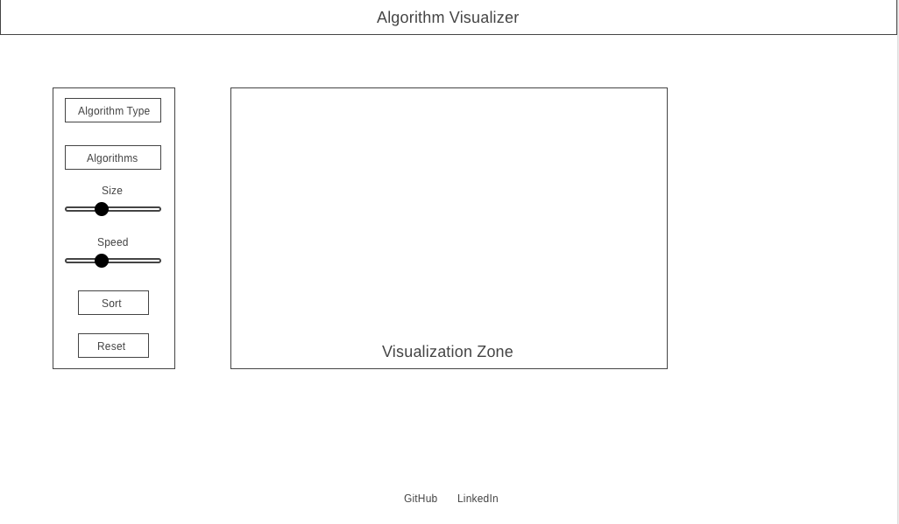

## Algorithm Visualizer

The Algorithm Visualizer is a tool that allows users to visualize how algorithms work under the hood.

Live: https://karlfleener.github.io/algorithm-visualizer/

## Table of Contents

- [Background and Overview](#background-and-overview)
- [Technologies](#Technologies)
- [Features](#features)
  * [Algorithms](#Algorithms)
  * [Dashboard](#dashboard)
  * [Media Content](#media-content)
  * [Favorites](#favorites)
- [Code Highlights](#code-highlights)
  *  [Rendering media](#rendering-media)
  *  [Favoriting and unfavoriting](#favoriting-and-unfavoriting)
- [The Team](#the-team)

## Background/Overview

Not sure how a certain algorithm works? Select the algorithm from the dropdown menu and click sort to see the selected algorithm come to life! If you want to visualize a greater amount of elements being sorted, or watch at a different speed, simply adjust the sliders accordingly and the changes take effect in realtime. If at any time you want to see a newly randomized collection of elements click the reset button.

## Technologies

- JavaScript
- HTML5
- Sass
- Canvas for animations
- Git for version control

## Features

* Users can choose from a selection of sorting algorithms to visualize
* Users can increase/decrease amount of elements to sort
* Users can increase/decrease the sorting time
* Users can reset/randomize elements

  

## Wireframes

## Future
* Continue adding sorting algorithms
* Add Errors
* Add pathfinding algorithms
* Increase amount of ways to visualize
